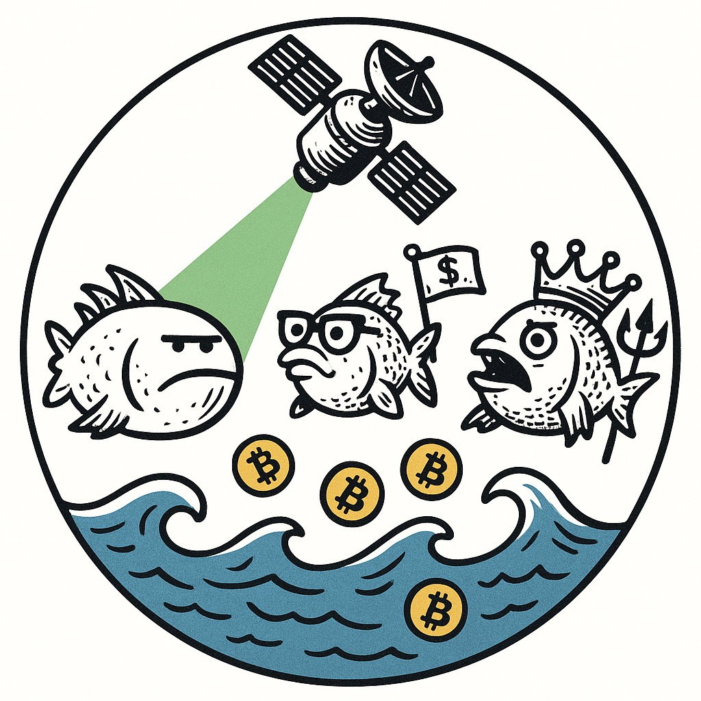

<table border="0px">
  <tr>
    <td width="220">
      
    </td>
    <td>
      <h1>FishSonar — Real-Time Market Fish Detector</h1>
      <b>FishSonar</b> is a professional, Clean Architecture Go service for real-time detection of "fishy" events on crypto exchanges.<br/>
      <i>Sonar for trading “fish” — powered by Binance stream and meme-grade analytics.</i>
    </td>
  </tr>
</table>

Ever wanted to spot a THICC FISH or a SLEEPY FISH in your trade stream? This project analyzes trades in real time, connects to Binance, and exposes a REST API for you or your bots.

**Server**: `stream.binance.com:9443/ws/btcusdt@trade`

---

## Why FishSonar?

Because the crypto market is full of fish — some lucky, most hopeless, and all easy prey for sharks.  
FishSonar doesn’t judge, it just detects.  
Use it to see the hidden shoals of trading “fish”… but don’t expect to catch a real shark:  
**this sonar only finds fish.**

> Looking for sharks? Sorry, they’re too smart for algorithms.  
> *(Maybe in the next version, when we finally attach an AI model and train it… But trust me, that’s a whole new level of pain.)*

---

### What does FishSonar actually do?

FishSonar shines a light on market behavior that would make any risk professional — or experienced poker player — wince.  
It finds those trades that echo classic poker mistakes: opening with weak ranges, calling out of position, overbetting with no clear plan, or chasing unlikely draws.  
In other words: FishSonar helps you **visualize suboptimal, high-risk, or simply questionable trading decisions** in real time.

**Practically, FishSonar highlights:**
- Large, impulsive trades (overbets with little context)
- Mistimed entries (trading at illiquid hours, or after large price swings)
- Clusters of indecisive activity (many small trades in bursts — often retail “herding”)
- "Hero calls" into obvious market strength (taking the wrong side when the odds are against you)

You can think of these as **trading leaks** — patterns that, over thousands of hands (or trades), usually signal negative expected value.

The tool is fully working and provides real-time market alerts,  
letting you observe the endless variety of “questionable” decisions in the wild.

> **Important note:**  
> FishSonar is a hobby project — not a full-fledged trading analytics suite.  
> While it’s a real working scanner, it doesn’t provide persistent data, deep order book context, or production-grade reliability.  
> True pro-level monitoring would require:
> - Full order book analysis and market microstructure awareness
> - Sophisticated clustering (identifying bots, repeat offenders, etc.)
> - Advanced anomaly detection (ML, outlier analysis)
> - After-the-fact P&L and impact estimation

**FishSonar is ideal for anyone curious about behavioral patterns on the exchange, market streamers, or those who simply want to watch the market’s “leaks” unfold in real time.**

---

**In short:**  
FishSonar gives you a window into the world of questionable trades — but the true sharks are still out there, one level deeper.

---

## Features

- **Real-time detection** of suspicious ("fishy") trades on Binance
- Detects several types of market fish:  
  `THICC FISH`, `SLEEPY FISH`, `DUMB FISH`, `ORDINARY FISH`, `LEVERAGE FISH`
- **Clean, modular architecture** — easy to extend or adapt for your own experiments
- REST API:
  - `/api/check-fish` — check the last trade for fishiness
  - `/api/fish-history` — view detected fish events
  - `/api/shark-advice` — receive questionable shark wisdom
- Configurable & testable (with unit tests)
- Designed for further AI/ML integration

---

# API Reference

## `GET /api/check-fish`

**Description:**  
Check for fishy trades in the recent time window.

**Query Parameters:**
- `seconds` (optional, integer):  
  Time window in **seconds** to scan for fishy trades.  
  Default: `10` (last 10 seconds).  
  Example: `?seconds=15`

**Example Request:**
```bash
curl http://localhost:8080/api/check-fish?seconds=15
```
``` example Response
[
  {
    "Trade": {
      "symbol": "BTCUSDT",
      "price": 117911.43,
      "quantity": 0.16,
      "timestamp": 1752956344955,
      "is_buyer_maker": true,
      "leverage": 0
    },
    "Type": "ORDINARY FISH",
    "Message": "This fish is minding its own business.",
    "Time": "2025-07-19T23:19:00.046506+03:00"
  },
  {
    "Trade": {
      "symbol": "BTCUSDT",
      "price": 117911.43,
      "quantity": 0.16,
      "timestamp": 1752956344955,
      "is_buyer_maker": true,
      "leverage": 0
    },
    "Type": "ORDINARY FISH",
    "Message": "Just another day at the fish market.",
    "Time": "2025-07-19T23:19:00.047506+03:00"
  }
]
```

## `GET /api/fish-history`

**Description:**  
Get history of detected fish events over a recent time period.

**Query Parameters:**
- `minutes` (optional, integer):  
  Time window in minutes to scan for fishy trades (1–60).  
  Default: `5` (last 5 minutes).  
  Example: `?minutes=20`

**Example Request:**
```bash
curl http://localhost:8080/api/fish-history?minutes=5
```

``` example response:
[
  {
    "Trade": {
      "symbol": "BTCUSDT",
      "price": 117950,
      "quantity": 0.21229,
      "timestamp": 1752956272115,
      "is_buyer_maker": true,
      "leverage": 0
    },
    "Type": "ORDINARY FISH",
    "Message": "In the ocean, even small ripples matter.",
    "Time": "2025-07-19T23:17:47.207506+03:00"
  }
]
```

## `GET /api/shark-advice`

**Description:**  
Get a shark verdict and a random shark trading message based on recent market activity.

```bash
curl http://localhost:8080/api/shark-advice
```

``` Example response
{
  "verdict": "Big fish detected! Shark mode: ON.",
  "shark_message": "Scent of fresh fish in the water — action time.",
  "thicc_fish": 0,
  "leverage_fish": 0,
  "total_fish": 13,
  "timeframe_min": 3
}
```


## Project Structure

- `cmd/` — main entry point
- `internal/detector/` — all fish detection logic
- `internal/infra/` — integrations (Binance WebSocket, REST API)
- `internal/model/` — domain models (Trade, FishEvent, etc.)
- `config/` — configuration files
- `scripts/` — automation and helpers

---

## Quick Start

1. **Install Go** (if not already):
    ```bash
    # For Linux/macOS:
    sudo apt install golang-go
    # or follow instructions: https://go.dev/doc/install
    ```

2. **Clone and build the project:**
    ```bash
    git clone https://github.com/swampus/FishSonar.git
    cd FishSonar
    go build ./cmd/main.go
    ./main
   
    #or just
    go run ./cmd/main.go
    ```

**Keywords:**  
`go`, `golang`, `crypto`, `binance`, `market-data`, `trading`, `websocket`, `rest-api`, `microservice`, `clean-architecture`, `event-detection`, `quant`, `fun`, `fintech`